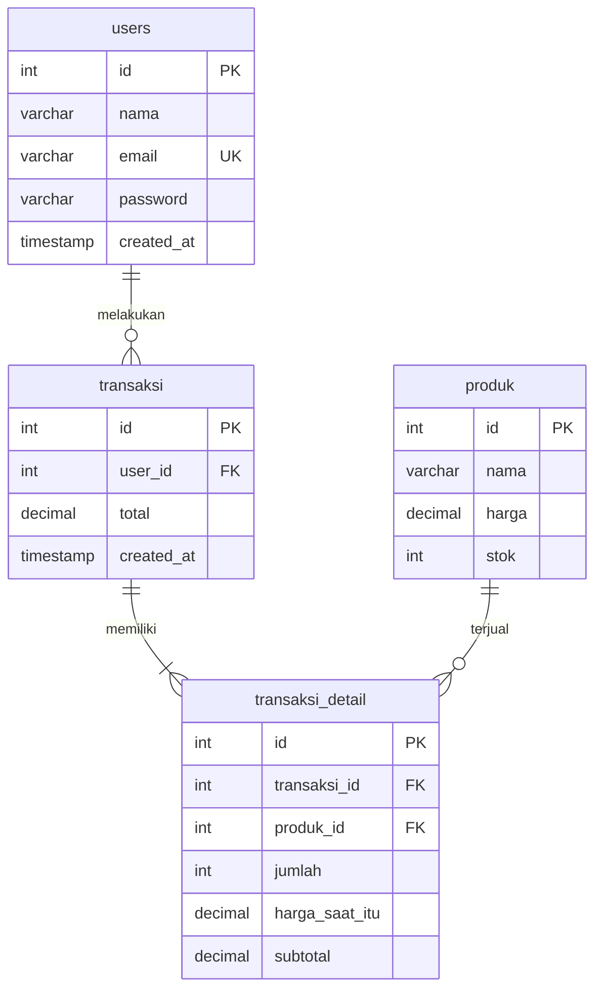

# 01 — Kasir / Point of Sale (Bootstrap 5)

Aplikasi kasir sederhana: kelola produk, buat transaksi penjualan dengan banyak item, dan lihat riwayat transaksi.

## Fitur

- CRUD produk (nama, harga, stok)
- Halaman kasir: pilih produk, atur jumlah, simpan transaksi (stok otomatis berkurang)
- Riwayat transaksi + detail item per transaksi
- Login & Sign Up (password bcrypt + session)

## ERD



## Menjalankan

```bash
mysql -u root -p < database.sql
php -S localhost:8000 -t public
```

Login: `admin@demo.test` / `admin123`
