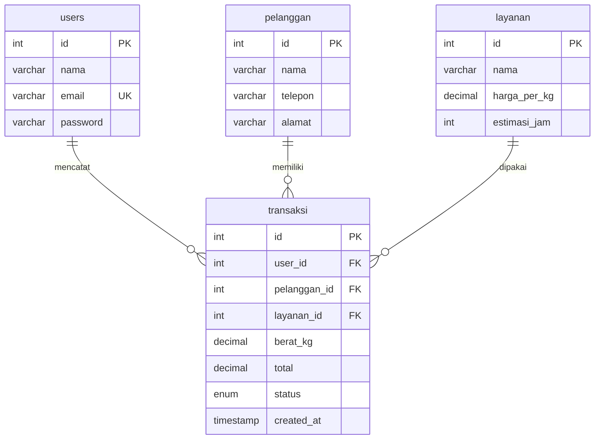

# 02 — Laundry (Custom CSS)

Aplikasi manajemen laundry: kelola pelanggan dan layanan, catat transaksi cuci berdasarkan berat (kg), dan pantau status pengerjaan.

## Fitur

- CRUD pelanggan (nama, telepon, alamat)
- CRUD layanan (nama, harga per kg, estimasi jam)
- Transaksi: pilih pelanggan + layanan, isi berat, total dihitung otomatis
- Status transaksi: proses / selesai / diambil
- Login & Sign Up (password bcrypt + session)

## ERD



## Menjalankan

```bash
mysql -u root -p < database.sql
php -S localhost:8000 -t public
```

Login: `admin@demo.test` / `admin123`
