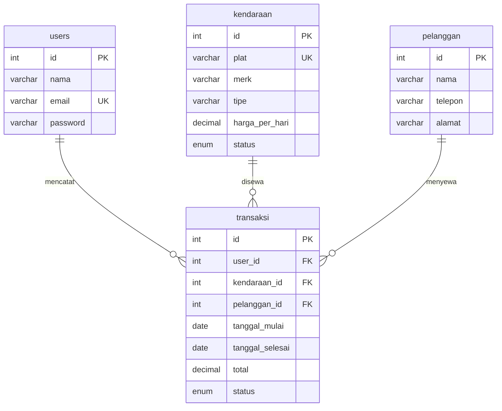

# 03 — Rental Kendaraan (Bootstrap 5)

Aplikasi rental kendaraan: kelola armada dan pelanggan, catat penyewaan harian, dan kembalikan unit.

## Fitur

- CRUD kendaraan (plat, merk, tipe, harga per hari, status)
- CRUD pelanggan
- Transaksi sewa: pilih kendaraan + pelanggan, tentukan tanggal mulai/selesai, total dihitung otomatis
- Status sewa: aktif / selesai — kendaraan otomatis tidak bisa disewa saat masih aktif
- Login & Sign Up (password bcrypt + session)

## ERD



## Menjalankan

```bash
mysql -u root -p < database.sql
php -S localhost:8000 -t public
```

Login: `admin@demo.test` / `admin123`
