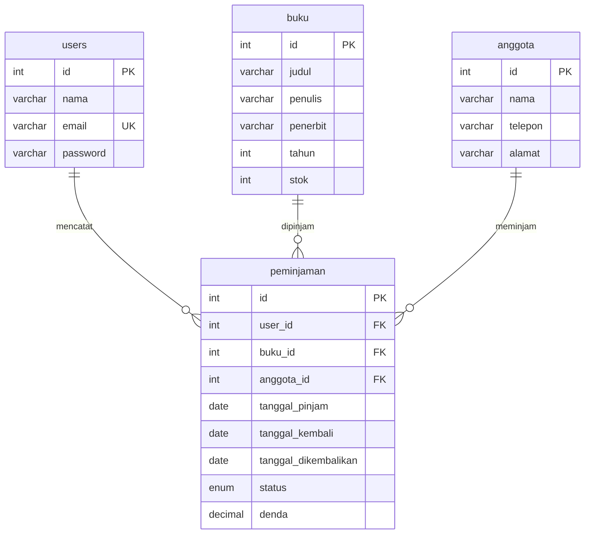

# 04 — Perpustakaan (Custom CSS)

Aplikasi perpustakaan: kelola buku dan anggota, catat peminjaman, proses pengembalian, dan hitung denda keterlambatan otomatis.

## Fitur

- CRUD buku (judul, penulis, penerbit, tahun, stok)
- CRUD anggota
- Peminjaman: pilih buku + anggota, stok otomatis berkurang
- Pengembalian: stok kembali, denda dihitung dari keterlambatan (Rp500/hari)
- Login & Sign Up (password bcrypt + session)

## ERD



## Menjalankan

```bash
mysql -u root -p < database.sql
php -S localhost:8000 -t public
```

Login: `admin@demo.test` / `admin123`
