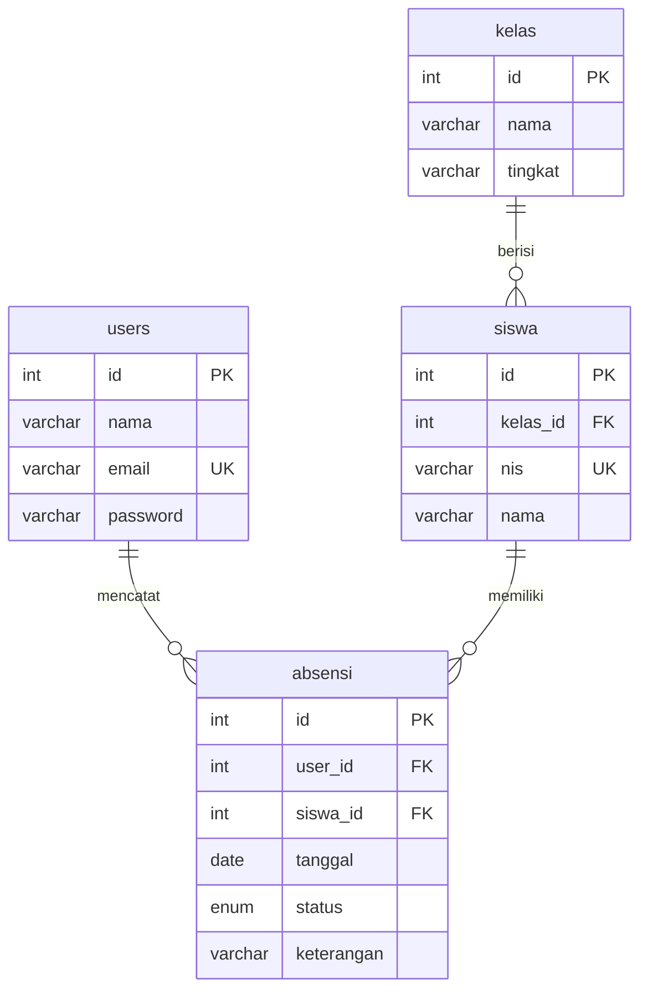

# 05 — Absensi Siswa (Bootstrap 5)

Aplikasi absensi sekolah: kelola kelas dan siswa, lalu catat kehadiran harian per kelas dengan rekap.

## Fitur

- CRUD kelas (nama, tingkat)
- CRUD siswa (nis, nama, kelas)
- Absensi harian per kelas: hadir / izin / sakit / alpa, satu entri per siswa per tanggal (unique)
- Rekap absensi per tanggal
- Login & Sign Up (password bcrypt + session)

## ERD



## Menjalankan

```bash
mysql -u root -p < database.sql
php -S localhost:8000 -t public
```

Login: `admin@demo.test` / `admin123`
