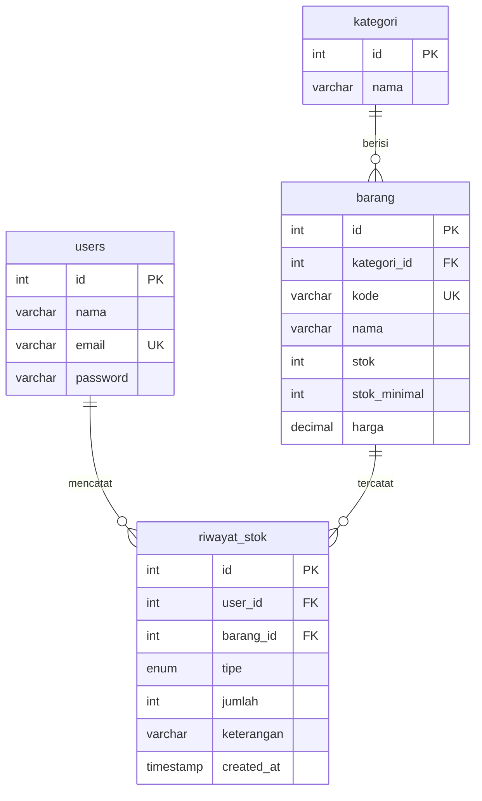

# 06 — Inventaris Barang (Custom CSS)

Aplikasi inventaris gudang: kelola kategori dan barang, catat barang masuk/keluar, dan pantau stok minimum.

## Fitur

- CRUD kategori
- CRUD barang (kode, nama, kategori, stok, stok minimal, harga)
- Stok masuk/keluar: setiap perubahan tercatat di riwayat stok
- Peringatan stok di bawah minimum
- Login & Sign Up (password bcrypt + session)

## ERD



## Menjalankan

```bash
mysql -u root -p < database.sql
php -S localhost:8000 -t public
```

Login: `admin@demo.test` / `admin123`
