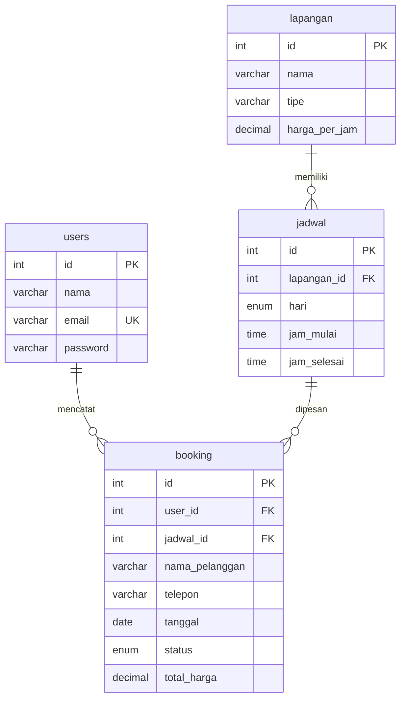

# 07 — Booking Lapangan (Bootstrap 5)

Aplikasi booking lapangan olahraga: kelola lapangan dan slot jadwal, terima booking, lalu konfirmasi atau batalkan.

## Fitur

- CRUD lapangan (nama, tipe, harga per jam)
- CRUD jadwal per lapangan (hari, jam mulai, jam selesai)
- Booking: pilih jadwal + tanggal, isi data penyewa, total dihitung dari durasi x harga
- Satu booking per jadwal per tanggal (unique), status: pending / konfirmasi / batal
- Login & Sign Up (password bcrypt + session)

## ERD



## Menjalankan

```bash
mysql -u root -p < database.sql
php -S localhost:8000 -t public
```

Login: `admin@demo.test` / `admin123`
