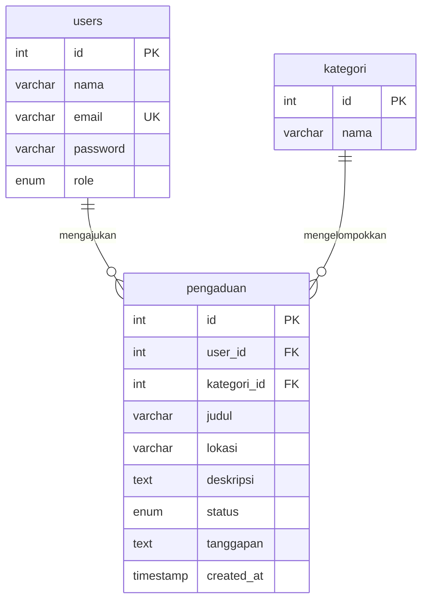

# 08 — Pengaduan Fasilitas (Custom CSS)

Aplikasi pengaduan fasilitas dengan dua peran: **user** mengajukan pengaduan, **admin** mengelola kategori dan menindaklanjuti dengan tanggapan.

## Fitur

- Login & Sign Up dengan role (`admin` / `user`)
- User: buat pengaduan (judul, kategori, lokasi, deskripsi), pantau status
- Admin: CRUD kategori, ubah status (pending / diproses / selesai / ditolak), beri tanggapan
- Riwayat pengaduan milik sendiri untuk user, semua pengaduan untuk admin

## ERD



## Menjalankan

```bash
mysql -u root -p < database.sql
php -S localhost:8000 -t public
```

Login:
- Admin: `admin@demo.test` / `admin123`
- User: `budi@demo.test` / `user123`
