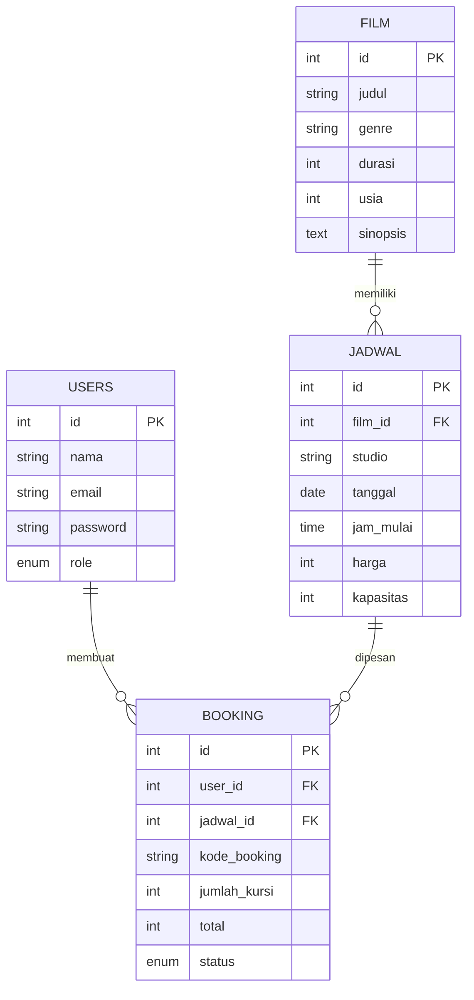

# 09 — Booking Tiket Bioskop

Aplikasi MVC PHP untuk katalog film, jadwal tayang, dan booking tiket bioskop. Varian ini menggunakan Bootstrap 5 dengan tema dark cinema.

## Fitur
- Auth signup/login dengan bcrypt dan session unik `exam09_bioskop`
- CRUD film dan jadwal tayang
- Booking beberapa kursi dengan validasi kapasitas real-time
- Kode booking otomatis dan pembatalan booking milik user
- Admin dapat melihat seluruh booking; user hanya melihat booking sendiri
- Guard foreign key saat film/jadwal masih digunakan

## Akun demo
- Admin: `admin@demo.test` / `admin123`
- User: `budi@demo.test` / `admin123`

## URL Laragon/XAMPP
`http://localhost/exam-bank/09-bioskop-bootstrap/`

## ERD

