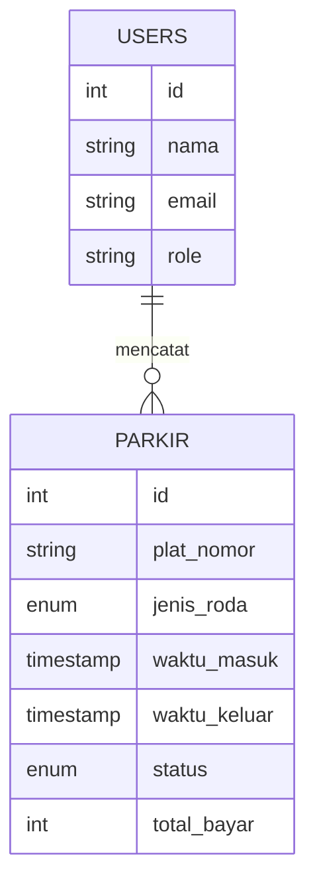

# Study Case 10 — Sistem Parkir

Aplikasi PHP native MVC untuk mencatat kendaraan masuk/keluar, menghitung tarif parkir, melihat laporan, dan mengunduh CSV.

## Fitur
- Login/register dengan bcrypt dan session unik.
- Dashboard admin: kendaraan aktif, kendaraan keluar hari ini, omzet hari ini.
- Parkir masuk: plat nomor dan jenis roda 2/4.
- Parkir keluar: pencarian plat, kalkulasi durasi dan modal konfirmasi pembayaran.
- Tarif roda 2: Rp2.000 jam pertama + Rp1.000/jam berikutnya.
- Tarif roda 4: Rp5.000 jam pertama + Rp1.000/jam berikutnya.
- Laporan berdasarkan rentang tanggal dan export CSV.
- Alert sebelum logout dan flash alert setelah transaksi tersimpan.

## Akun demo
- Admin: `admin@parkir.test` / `admin123`
- User: `petugas@parkir.test` / `admin123`

## ERD

Import `database.sql`, sesuaikan `config/database.php`, lalu buka `/exam-bank/10-parkir-bootstrap/`.
